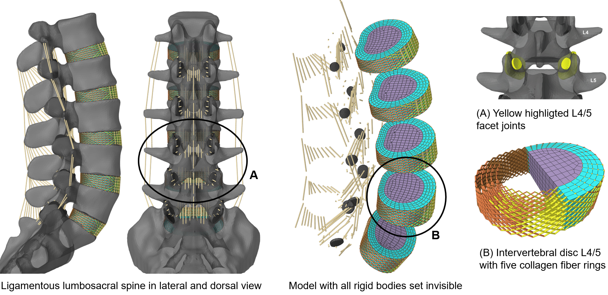

# Hybrid lumbosacral spine model built in ArtiSynth  

This repositry holds a calibrated and validated model of a passive lumbosacral spine based on the data of the [Male Visible Human Project](https://www.nlm.nih.gov/research/visible/visible_human.html). The model is built with the freely available 3D modeling platform [ArtiSynth](https://www.artisynth.org) that supports the combined simulation of multibody and finite element models, together with contact and constraints. As part of an active hybrid model of the human trunk which includes muscles and inverse dynamics, we are continuously improving this model and are open to suggestions for improvements and new potential applications.  

If you use the model or parts of it in your research, please cite the following reference:  
> Remus R, Lipphaus A, Neumann M, Bender B (2021) Calibration and validation of a novel hybrid model of the lumbosacral spine in ArtiSynth–The passive structures. PLoS ONE 16(4): e0250456. [https://doi.org/10.1371/journal.pone.0250456](https://doi.org/10.1371/journal.pone.0250456)
 

Combined loading modes are used in the following video sequence to move the lumbosacral spine sequentially in four different physiological postures: extension, flexion, left axial rotation and right lateral bending. The loading modes also used in the model validation are each composed of a moment in the range of 5.5 to 7.8 Nm on vertebra L1 and a compressive follower load between 500 and 1175 N.

## What this repository includes
* The Java code to build the model. Due to continuous further development, the most current status is always available here. When preliminary results are published the codes and files are freezed under [Relaeses](https://github.com/RemusR9/artisynth_lumbosacralSpineModel/releases).
* The implemented material models for ligaments and collagen fibers with their input data (.lig and .txt). 
* The symmetrized and postprocessed geometry data (.obj) of the rigid vertebrae L1-L5, the sacrum (S1) and the superior articular processes.
* The input data (.node and .elem) for the meshed discs L1/2 to L5/S1 in the subfolder `/FE/LSS_20200529/`. For modeling the via point collagen fibers through the annuli fibrosi nodes, the defining node sets (.fiber) are also stored there. The files are structured as follows: 
  - First line - number c of collagen fibers for this ring. 
  - Line 2 to c+1 - For each line, all nodes in the correct order for the via point of a collagen fiber. First and last nodes are located at the upper and lower edges of the disc, respectively, and are thus connected to the adjacent vertebrae. 
  - c+2 - control word 'end'
  - c+3 - Summed length of all c collagen fibers in this ring
* Since the newer release for the [ISSLS 2021](https://www.issls.org/issls-annual-meeting-2021/), we build the inferior articular facets simplified by extrusion from faceted surfaces (.obj) from the `/FE/LSS_Facets/` subfolder.
* Auxiliary geometries (.obj) to automatically identify the location of collagen fibers in the disc to assign varying material parameters (`/RB/auxGeometries/`). 

## Some tips for using the model
- Always ramp external forces and moments (increase their amplitude evenly distributed over several time steps) to prevent inverted elements in the FE discs. This can be done manually by increasing the numbers and moving the sliders in the simulation control window or automatically by using an input probe - what I would recommend. 
- More info will follow here soon ...

## License
This source code is licensed under the BSD-3-Clause license found in the [LICENSE file](LICENSE) in the root directory of this source tree. 
